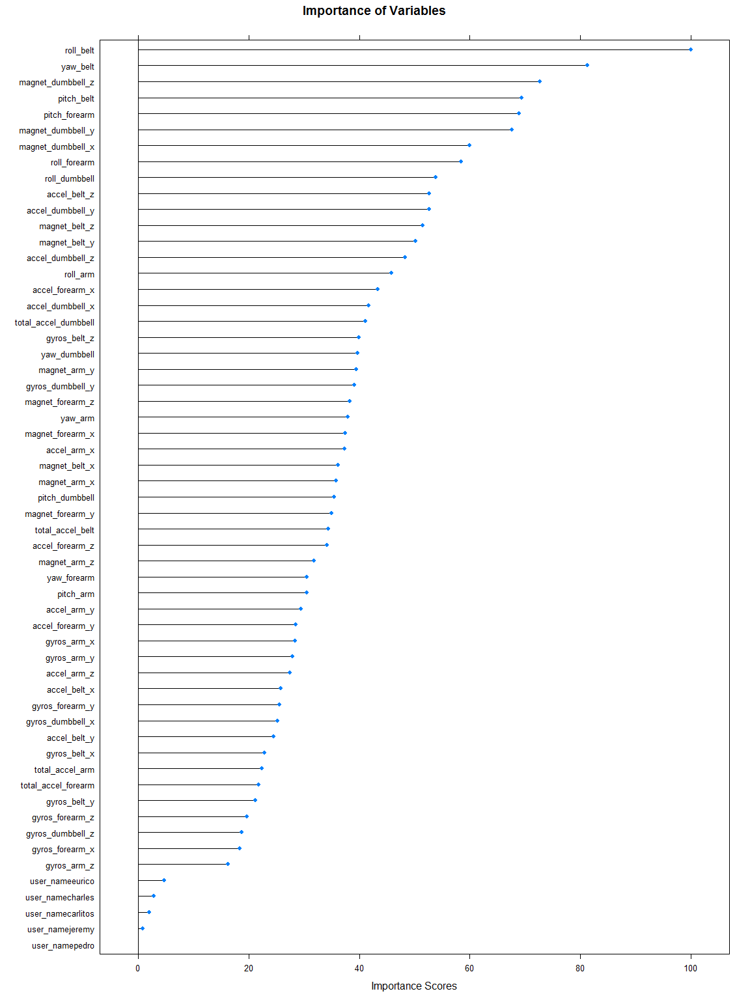

# Applying a Machine Learning Technique to a Quality Activity Recognition Dataset

by A. Brignole
(February - March 2016),
Practical Machine Learning,
Professor Jeff Leek, Ph.D.


**Abstract:** Velloso et al. (2013) electronically collected data on the motions of six human participants that replicated a common muscle building exercise, lifting dumbbells. The purpose of this project was to create a predictive machine-learning algorithm in R that classifies the manner in which the participants lifted the dumbbell. A Random Forest predictive model was fit to 13,453 observations of data using the *caret* package in the R. A stratified sample (strata = 5, n =5,763) tested the validity of the 12-fold, cross-validated, Random Forest model. The accuracy of the pretest results were 99.0% (95% CI 98.7 - 99.2%, *p* < 0.001), with sensitivities for each class ranging from 96.5% to 100% and specificities ranging from 99.3% to 100%, suggesting an excellent model fit. A set of 20 test cases of data further checked the predictive capabilities of the model. The prediction of only six of the test cases matched the expected results (accuracy: 30%, 95% CI: 11.3 - 54.3%, *p* = 0.87). Given the high accuracy of the pretest, the author speculates that the small subset of 20 cases contains data from a non-conforming sub-population, transformed data, or other issues that the model did not consider in its design.

###Introduction (Defining the Problem).###

Velloso, Bulling, Gellerson, Ugulino, and Fuks (2013) collected data in order to ascertain whether a predictive machine learning model could inform individuals on how well an exercise was performed. To do so, the authors asked six human participants to 'curl' a dumbbell ten times according to five different methods. The participants wore electronic sensors on their hand, arm, and waist, with an additional sensor attached to the dumbbell itself. The sensors tracked the motion of the participants and the dumbbell over timed increments.  

The five 'curling' methods simulated common weight-lifting techniques.  Only one 'curling' technique followed an instructionally sound method. The other four methods emulated common lifting mistakes.  In this way, the study classified the manner in which the participants exercised.  The overall premise of the study was to test whether real-time feedback to an individual would facilitate the weight lifting experience.  The column of data with the exercise method (the dependent variable, a.k.a. outcome variable) was listed as "classe".  In total, Velloso et al, collected or calculated one-hundred fifty-nine different metrics (independent variables, a.k.a. predictor variables).

This paper utilizes the data collected by Velloso et al, and attempts to substantiate the claims that the data provide a means to predict the method of exercise.

###Materials and Methods.###

Velloso et al maintain the supporting documents for their study on the internet site <http://groupware.les.inf.puc-rio.br/har>. The data from Velloso et al was given as two datasets, a training set and a testing set. The two sets of data were read into R.

```r
     trainset<-read.csv("https://d396qusza40orc.cloudfront.net/predmachlearn/pml-training.csv",
               stringsAsFactors = FALSE)
     
     testset<-read.csv("https://d396qusza40orc.cloudfront.net/predmachlearn/pml-testing.csv", 
          stringsAsFactors = FALSE)
```

The training set had 160 variables (columns), and 19,622 observations (rows). The testing dataset had 160 variables and 20 observations. Not all columns and observations were included when formulating the model, only spatial quantifications, and user name.

```r
     ##Delete rows that are not no new_window.
     noWindowTr <-trainset[trainset$new_window == "no",]
     noWindowTe<-testset[testset$new_window == "no",]
     
     ##Delete Columns that are not in testing dataset.
     namesetTr<-names(noWindowTr); namesetTe<-names(noWindowTe)
     
     deleteset<-c("amplitude", "avg", "kurtosis", "max", "min", "skewness", "stddev", "var")
     
     for(i in 1:8) {
          var<-deleteset[i]
     
          DeleteColTr<-grep(var, namesetTr); DeleteColTe<-grep(var, namesetTe)
          
          if(i == 1){
               NoColsTr<-DeleteColTr; NoColsTe<-DeleteColTe
          } else {
               SetTr<-DeleteColTr; NoColsTr<-c(NoColsTr,SetTr)
               SetTe<-DeleteColTe; NoColsTe<-c(NoColsTe,SetTe)
          }
          RemoveColsTr<-sort(unique(NoColsTr)); RemoveColsTe<-sort(unique(NoColsTe))
     }
     varTrSet<-noWindowTr[,-c(1, 3, 4, 5, 6, 7, RemoveColsTr)]
     varTeSet<-noWindowTe[,-c(1, 3, 4, 5, 6, 7, RemoveColsTe)]
          
     varTrSet$user_name <- as.factor(varTrSet$user_name)
     varTeSet$user_name<-as.factor(varTeSet$user_name)
     
     varTrSet$classe<- as.factor(varTrSet$classe)
```

###Fitting the Predictive Model###

A Random Forest Model was fit to the data. Random Forests typically perform well compared to other predictive algorithms. They iteratively test the probabilistic outcomes via decision trees. The outcomes are then aggregated in determination of the model. Velloso et al fit a Random Forest algorithm to the data, applying a leave-one-out cross-validation training method. This method is very resource intensive.  In the interest of time, this study fit a folded cross-validation method. 

To run the Random Forest algorithm, the caret package was loaded into R.

```r
     library(lattice); library(ggplot2);library(dplyr); library(caret); library(randomForest)
```

The training dataset was further partitioned into a pretest subset and an actual training subset.  The pretest subset offered a check of the results prior to comparison of the twenty test cases.


```r
     set.seed(1)
     inTrain<-createDataPartition(varTrSet$classe, p = 0.7, list= FALSE)
     
     pretest<-varTrSet[-inTrain,]; training<-varTrSet[inTrain,]
```

A Random Forest Model was fit to the data, using a cross-validation of twelve folds. Running the code for twelve folds took longer than ten. The increase in folds was selected to reduce variability, and increase accuracy of the model results. A few attempts of fitting the model with fewer folds or greater replications returned equally good or less accurate results. The model with two randomly selected parameters was the most accurate fit. 


```r
     set.seed(2)
     modRF<-train(classe~., data = training, method = "rf", trControl = trainControl("cv", 12, 1), verbose = FALSE)
     modRF
```

```
## Random Forest 
## 
## 13453 samples
##    53 predictor
##     5 classes: 'A', 'B', 'C', 'D', 'E' 
## 
## No pre-processing
## Resampling: Cross-Validated (12 fold) 
## Summary of sample sizes: 12333, 12332, 12331, 12332, 12333, 12331, ... 
## Resampling results across tuning parameters:
## 
##   mtry  Accuracy   Kappa      Accuracy SD  Kappa SD   
##    2    0.9930134  0.9911611  0.002242037  0.002836829
##   29    0.9928648  0.9909736  0.002341991  0.002963488
##   57    0.9855803  0.9817572  0.002760093  0.003493882
## 
## Accuracy was used to select the optimal model using  the largest value.
## The final value used for the model was mtry = 2.
```

Examining the final model results show an estimated out-of-bag error rate of 0.64%. A good result would be close to zero. These results confirmed that the model would be amenable for prediction.

The variables that were most important in fitting the model are shown in the graph below.

```r
     modRF$finalModel; 
```

```
## 
## Call:
##  randomForest(x = x, y = y, mtry = param$mtry, verbose = FALSE) 
##                Type of random forest: classification
##                      Number of trees: 500
## No. of variables tried at each split: 2
## 
##         OOB estimate of  error rate: 0.64%
## Confusion matrix:
##      A    B    C    D    E class.error
## A 3830    0    0    0    0 0.000000000
## B   15 2582    6    0    0 0.008067614
## C    0   17 2327    3    0 0.008521517
## D    0    0   39 2163    1 0.018157059
## E    0    0    1    4 2465 0.002024291
```

```r
     plot(varImp(modRF), main = "Importance of Variables", xlab = "Importance Scores")
```

 

```r
     png(filename = "ImpPlot1.png", width = 480, height = 600)
```

###Testing the Model###

To legitimize the model fit and test for overfitting, the subset, pretest data were compared to Random Forest model with the best fit. The accuracy of the model was a stunning 99.0% (95% CI: 98.7% - 99.2%, n = 5,763, *p* < 0.001), with sensitivities between 96.5% and 100%, and specificities between 99.3% and 100%. Truly remarkable.


```r
     pred1<-predict(modRF, pretest); confusionMatrix(pred1, pretest$classe)
```

```
## Confusion Matrix and Statistics
## 
##           Reference
## Prediction    A    B    C    D    E
##          A 1641   10    0    0    0
##          B    0 1104    9    0    0
##          C    0    1  994   33    0
##          D    0    0    2  911    4
##          E    0    0    0    0 1054
## 
## Overall Statistics
##                                           
##                Accuracy : 0.9898          
##                  95% CI : (0.9868, 0.9922)
##     No Information Rate : 0.2847          
##     P-Value [Acc > NIR] : < 2.2e-16       
##                                           
##                   Kappa : 0.987           
##  Mcnemar's Test P-Value : NA              
## 
## Statistics by Class:
## 
##                      Class: A Class: B Class: C Class: D Class: E
## Sensitivity            1.0000   0.9901   0.9891   0.9650   0.9962
## Specificity            0.9976   0.9981   0.9929   0.9988   1.0000
## Pos Pred Value         0.9939   0.9919   0.9669   0.9935   1.0000
## Neg Pred Value         1.0000   0.9976   0.9977   0.9932   0.9992
## Prevalence             0.2847   0.1935   0.1744   0.1638   0.1836
## Detection Rate         0.2847   0.1916   0.1725   0.1581   0.1829
## Detection Prevalence   0.2865   0.1931   0.1784   0.1591   0.1829
## Balanced Accuracy      0.9988   0.9941   0.9910   0.9819   0.9981
```

However, comparing our model fit to the testing dataset, the matched results were much more disappointing. The accuracy was 30% (95% CI: 11.9 - 54.3%, n = 20, *p* = 0.87). From the previous accuracies based on random sampling, there may be additional explanation as to why these data did not fit our model (e.g.: transformed data, purposefully selected outliers, etc...).


```r
   #Check predictions.
     varTeSet$user_name <- as.factor(varTeSet$user_name)
     predFinal<-predict(modRF, varTeSet) 
     
     testwindows<-as.integer(unique(testset$num_window))
     
     checkwindows<-unique(trainset[trainset$num_window %in% testwindows ,c("num_window", "classe")])
     
     checkset<-merge(testset, checkwindows);  confusionMatrix(predFinal, checkset$classe)
```

```
## Confusion Matrix and Statistics
## 
##           Reference
## Prediction A B C D E
##          A 3 3 0 0 1
##          B 3 3 0 0 2
##          C 1 0 0 0 0
##          D 0 1 0 0 0
##          E 0 1 1 1 0
## 
## Overall Statistics
##                                           
##                Accuracy : 0.3             
##                  95% CI : (0.1189, 0.5428)
##     No Information Rate : 0.4             
##     P-Value [Acc > NIR] : 0.8744          
##                                           
##                   Kappa : -0.0145         
##  Mcnemar's Test P-Value : NA              
## 
## Statistics by Class:
## 
##                      Class: A Class: B Class: C Class: D Class: E
## Sensitivity            0.4286   0.3750   0.0000   0.0000   0.0000
## Specificity            0.6923   0.5833   0.9474   0.9474   0.8235
## Pos Pred Value         0.4286   0.3750   0.0000   0.0000   0.0000
## Neg Pred Value         0.6923   0.5833   0.9474   0.9474   0.8235
## Prevalence             0.3500   0.4000   0.0500   0.0500   0.1500
## Detection Rate         0.1500   0.1500   0.0000   0.0000   0.0000
## Detection Prevalence   0.3500   0.4000   0.0500   0.0500   0.1500
## Balanced Accuracy      0.5604   0.4792   0.4737   0.4737   0.4118
```


**References**

Velloso, E., Bulling, A., Gellersen, H., Ugulino, W., and Fuks, H. Qualitative Activity Recognition of Weight Lifting Exercises. Proceedings of 4th International Conference in Cooperation with SIGCHI (Augmented Human '13). Stuttgart, Germany: ACM SIGCHI, 2013.  Read more at <http://groupware.les.inf.puc-rio.br/har#ixzz40a8Ba8fh>

